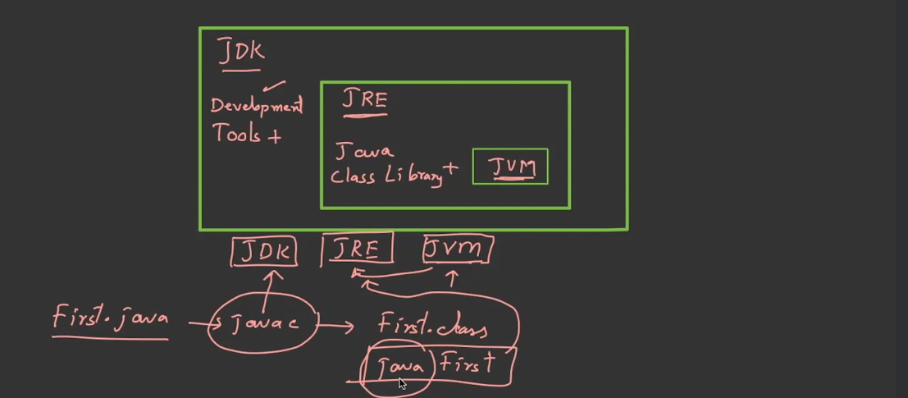

# What is JDK & JVM & JRE?

### JDK (Java Development Kit)
* **Role:** It's the tool for Developing Java programs.
* **How It Works:** The JDK includes a compiler to turn your Java code into a format the computer can understand (bytecode).
* It also includes the JRE to test and run the programs you make.

### JRE (Java Runtime Environment)
* **Role:** It's the setup needed to run Java programs.
* **How It Works:** The JRE includes libraries and components that help your Java programs run.
* It includes the JVM, which is the part that actually runs your programs.

### JVM (Java Virtual Machine)
* **Role:** It's the part that runs Java programs.
* **How It Works:** The JVM reads the bytecode (compiled Java code) and translates it into machine code that your computer can execute.

### How They Work Together:
* JDK: You use it to write and compile Java programs.
* JRE: Provides the environment and libraries needed to run Java programs.
* JVM: Runs the bytecode produced by the JDK, turning it into machine code your computer can understand.

