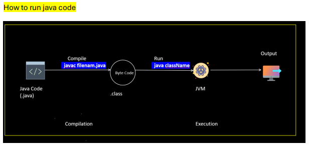

## What is Java?

* Java is a popular high-level, object-oriented programming language, which was originally developed by Sun Microsystems and released in 1995

* Java is Platform independent it allows your application to perform compilation and execution on any operating system that programming lang is called platform independent

* .class is more secure

```java
public class Skeleton_Of_Java {
    // class name should be same as file name.

    // main method
    public static void main(String[] args) {
        System.out.println("Hello World"); // printing on the screen.
    }
}

// javac filename --> Once you run this command .class file is generated --> filename.class (Byte Code) --> Java filename --> JRE +JVM  will execute --> Output
```

### What is Class? 

* Class is blue-print which can hold all the methods.
* Without Class, we cannot create any java program
* Class does not have memory
* This our class name --> Skeleton_Of_Java

### why public static void main(String[] args) ?

* **Public is a access modifier**
  - why main method is public reason is that to access main method out the class and call we declare it has public. 
  - JVM will access main method from outside the class to run the program. if we are not mentioning the public then we get an error because JVM will not access main method.
* **Static** 
    - Why Main method is static because without creating object we can access the main method.
    - if there is no static in main method then we have to create object to access the main method.
* **Void**
    - void is datatype and will write before the function or method.
    - if we write void before the method or function name then you don't want to return anything.
* **String**
    - Pre-defined class
* **args[]**
    - array type



### How to run Java Program

* Compilation --> javac filename
* Execution--> java filename


### What is Java Program Structure?

1. Package Statement
2. Import Statement
3. Class Declaration
4. Variable Declaration
5. Method Declaration

