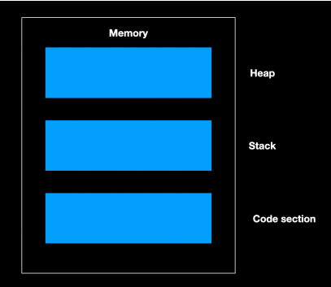
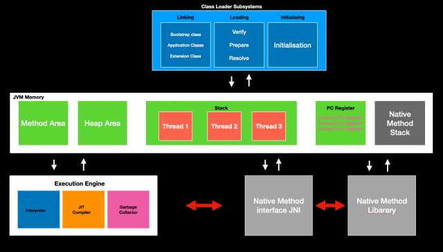

### Architecture of JVM

JVM is responsible for executing the java code

The main memory is in 3 parts one where the main program
resides , the other for storing the program data like variables
etc this values are stored in stack area , the last space is free
space which is used during the run time of program and is
called heap area

The file with the program is loaded into the code section and
the process is called class loading as all java code is in class
format 

The job of bringing the code into memory is done by class
loader

The interpreter inside Java code is used to convert the code
into the machine code and get executed

Dynamic values are created inside heap when you say new

Local variables are created inside stack and they belong to
main memory 

When print is called its own stack is created

JVM also has garbage collector it takes away the values in
heap which are not in use

JVM keeps the addresses of next instructions that needs to
be executed and it will hand it over to the CPU

In java we can invoke or call the methods of other languages
like c , c++ this is called native methods, they will be a
separate stack for this

#### A diagram representing the detail working of JVM Architecture

