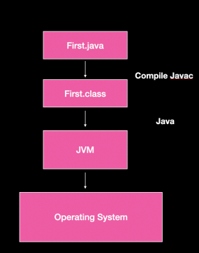
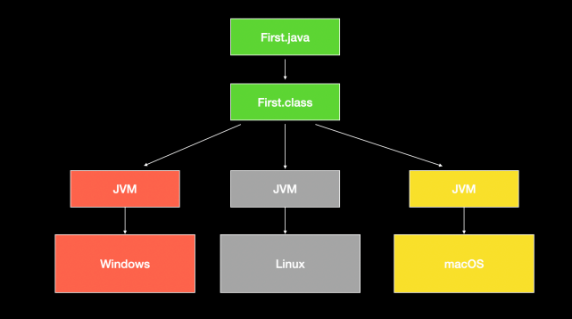

### Compiler v/s Interpreter

The main aim of theses two are
1. To check errors
2. Convert into machine code
3. Execution / running a program : Compiler does not takes
   responsibility of execution , Interpreter is responsible for execution of
   code
### Compiler
* Compiler will convert program into machine code if they are no error
* Compilation from source code to machine code is done only once
* As translation is done once that’s why compiler doesn't run codes
* Even if there’s one error in the program , it will not compile the full code
   must be error free to transform into machine code.

### Interpreter
* JavaScript is an interpreter based language
* JS runs inside browser , it cannot run independently
* It translates and runs /executes the code line by line
* Translation is done again and again

### Summary

* Compiler is faster than interpreter
* In interpreter if there is error in one line the code will still execute
* Interpreter language is easy than compiler language

### How Java is Platform Independent?

* Java is platform independent language
* Java compiler will convert source code into byte code although
  this byte code is not executable but it is a error free program
* To execute this java program we call a JVM ( java virtual
  machine ) and ask them to execute this file 
* This virtual machine will have an interpreter or JIT Compiler that
  will convert this byte code into machine code and get it executed
  on the hardware
* JVM cannot directly interact with the hardware , it needs to
  interact via a software like OS

* All the bytes codes first interact with JVM , as it is the source
  which converts the source code into the machine code of java
* As the byte code is same it can run on various operation system
  and produce the same result provided that it has a JVM hence
  Java is platform independent
* Therefore once you compile a java code you can run it anywhere 

