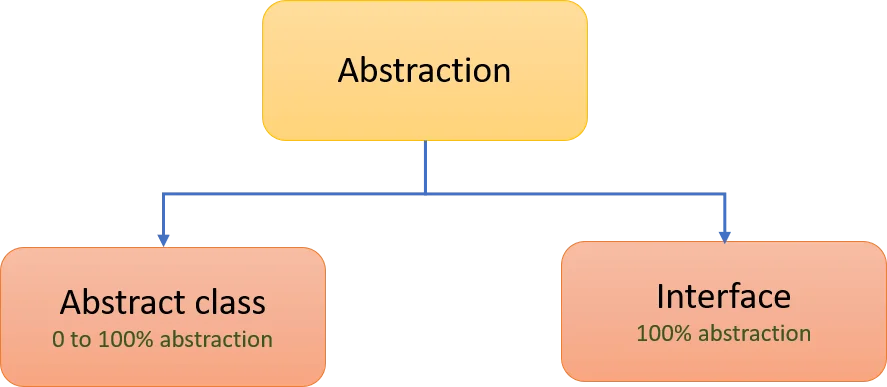
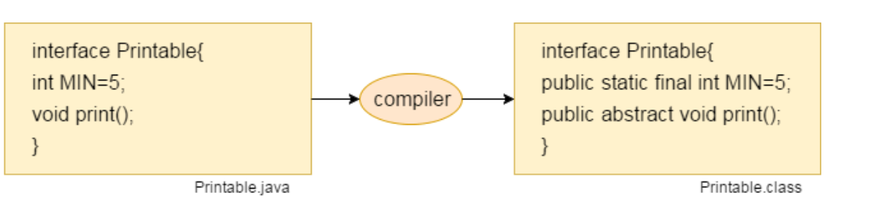
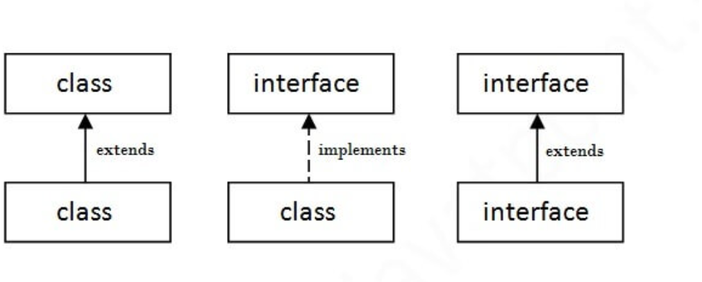
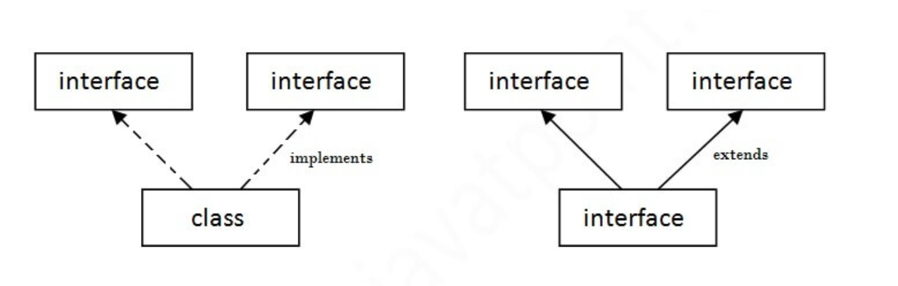

### what is Abstraction?
* Abstraction is a process of hiding the implementation details and showing only functionality to the user.

* Example
  - Consider a man driving a car, while driving he focuses on using of steering, gear,
    accelerator etc.
  - He does not require to know the inner mechanism of the car.
  - ATM like cash withdraw etc. we don't know the internal details about ATM.
  - Phone call we don't know the internal details.


There are two ways to achieve abstraction in java
 


### What is an Abstract Class?
* If an abstract keyword is	used before	the	class then it is an	Abstract class
* It needs to be extended and its method implemented. It cannot be instantiated.

* Note:
  - An abstract class must be declared with an abstract keyword.
  - It can have abstract and non-abstract methods.
  - It cannot be instantiated.
  - It can have constructors and static methods also.
  - It can have final methods which will force the subclass not to change the body of the method.


* There	are	two	types of classes
  - Abstract class --> Abstract keyword is used
  - Concrete class --> Normal class
- The Purpose of abstract class is to achieve polymorphism and inheritance

### Different between Abstract class and concrete class:

| Abstract Class                                            | Concrete Class                                                 |
|-----------------------------------------------------------|----------------------------------------------------------------|
| You can't create an object when your class is abstract    | You can create an object when your class is concrete           |
| you can create a reference to that class                  | you can create reference and object to that class              |
| eg: sub s = new sub(); -> Not Allowed                     | eg: sub s = new sub(); -> Allowed                              |
| eg: sub s; -> reference	of	abstract	class	is	allowed      | eg: sub s;-> Reference is Allowed                              |
| if	Abstract is	written	before	class	then	it	is	a	Abstract | if	nothing	is	written	before	class then it is a	Concrete	class |

### what is Abstract Method in Java
* A method which is declared as abstract and does not have implementation is known as an abstract method.
* The	abstract	method	is	undefined	method
Example:
```
 abstract void printStatus();//no method body and abstract
```
Example of Abstract class that has an abstract method:
```java
package Chapter_11_OOPS.Chapter_02_Abstraction;
abstract class Super{

    // constructor for super class
    public Super(){
        System.out.println("Super Class Constructor");
    }
    // creating method in super class
    public void meth1(){
        System.out.println("Super class method 1");
    }
    // creating abstract method when you create abstract method then you need to make your class as abstract.
    abstract public void meth2();
}
// creating another class or we can call concrete class
class Sub extends Super{
    // when you inherit the super class in subclass you need to override the abstract class from super class if not declare as abstract keyword in subclass.
    public void meth2(){
        System.out.println("Sub Class Method");
    }
}
public class Abstract_Class_01 {
    public static void main(String[] args) {
        // when your class is abstract you can't create object for that class. you can create a reference to abstract class
        // Super su = new Super();
        // su.meth1();

        // we can create a object for concrete class
        Sub s = new Sub();
        s.meth1();
        s.meth2();
    }
}

```
* A	class	is	Abstract	class	if	at	least	one	of	the		methods	is	abstract
* If any	other	class	inherits	abstract	class	then	that	class	also	becomes
  abstract	class	but	to	become	a	concrete	class	the	subclass	must
  override	the	undefined	method
* A	class	becomes	useful	if	it	overrides	all	the	methods	of	abstract	class
* Abstract	classes	are	used	for	imposing	standards	and	sharing methods
* Subclasses	are	meant	for	following	standards

#### Abstract class having constructor, data member and methods
* An abstract class can have a data member, abstract method, method body (non-abstract method), constructor, and even main() method.

```java
 abstract class Bike{  
   // constructor for Bike 
   Bike()
   {
       System.out.println("bike is created");
   }  
   // Abstract methods without implementing
   abstract void run();
   // Non-Abstract method with some implementing 
   void changeGear(){
       System.out.println("gear changed");
   }
 }  
 //Creating a Child class which inherits Abstract class
class Honda extends Bike{
  // to become Honda class as concrete we need to override the abstract method   
  void run(){
      System.out.println("running safely..");
  }
}
//Creating a Test class which calls abstract and non-abstract methods  
class TestAbstraction2{
  public static void main(String args[]){
    // creating object for Honda  
    Bike obj = new Honda();
    obj.run();
    obj.changeGear();
  }
}
```
```Output
bike is created
running safely..
gear changed
```

### Dos and Don't of Abstract Class
* An	Abstract	class	cannot	be	final	because	if	it	is	made	final	then	it
cannot	be	extended	whereas	abstract	class	is	meant	for inheritance
* An	Abstract	method	cannot	be	final	because	if	it	made	final	then	it
cannot	be	overridden	whereas	Abstract	method	is	meant	for overriding		
* Abstract	Class	and	method	can	neither	be	final	nor	static		
* A	Sub	class	must	override	an	abstract	method	or	else	it	will	become abstract	class

### What is interface in java?
* An interface in Java is a blueprint of a class. It has static constants and abstract methods.
* The interface in Java is a mechanism to achieve abstraction.
* There can be only abstract methods in the Java interface, not method body.
* It is used to achieve abstraction and multiple inheritance in Java.
* In other words, you can say that interfaces can have abstract methods and variables. It cannot have a method body.
* Java Interface also represents the IS-A relationship.
* It cannot be instantiated just like the abstract class.
* Since Java 8, we can have default and static methods in an interface.
* Since Java 9, we can have private methods in an interface.
* Classes	are	extended	but	Interfaces	are	implemented.
* In	Interface,	we	can	have	reference	of	interface	and	the	object	of	the class	which	is	implemented.
* In java	a	class	can	extend	from	one	class	only	but	if	a	class	is implementing	an	interface	then	it	can	implement	from	multiple interfaces
* Interface	can	be	call	as	Abstract	Class	with	all	abstract	methods.
* All	the	methods	are	by	default	abstract.

### Why use Java interface?
* There are mainly three reasons to use interface
  - It is used to achieve abstraction.
  - By interface, we can achieve of multiple inheritance.
  - It can be used to achieve loose coupling.

### Why use interface when we have abstract classes?

Abstraction is achieved by the use of interface and abstract class, However the reason for using interface is that abstract class may contain non-final variables, while interface variables are public,final and static.

### How to declare an interface?

* An interface is declared by using the interface keyword
* It provides total abstraction; means all the methods in an interface are declared with the empty body, and all the fields are public, static and final by default.
* A class that implements an interface must implement all the methods declared in the interface.

Syntax:
```
interface <interface_name>{
    // declare constant fields  
    // declare methods that abstract   
    // by default.  
}  
```
* Internal addition by the compiler
* The Java compiler adds public and abstract keywords before the interface method. Moreover, it adds public, static and final keywords before data members.
  

```java

interface Test{
    void meth1();
    void meth2();
}
// creating class, and we should not use extend it will throw an error.
class My implements Test{

    @Override
    public void meth1() {
        System.out.println("meth1 of my class");
    }

    @Override
    public void meth2() {
        System.out.println("meth2 of my class");
    }
    public void meth3(){
        System.out.println("meth3");
    }

}
public class interface_01 {
    public static void main(String[] args) {
        // you can create a reference, but you cannot create  an object
//        Test t = new Test()
        // interface are meant for run time polymorphism
        Test t = new My();
        t.meth1();
        t.meth2();

    }
}
```

#### The relationship between classes and interfaces
* a class extends another class, an interface extends another interface, but a class implements an interface.
```java
package Chapter_14_Abstract_Class;
class Phone{
    void call(){
        System.out.println("Phone call");
    }
    void Sms(){
        System.out.println("Phone Sms");
    }
}
interface ICamera{
    void Click();
    void Record();
}
interface IMusicPlayer{
    void Play();
    void Stop();
}
class SmartPhone extends Phone implements ICamera,IMusicPlayer{

    public void videoCall(){
        System.out.println("Smart Phone video calling");
    }
    @Override
    public void Click() {
        System.out.println("Smart Phone Click");
    }

    @Override
    public void Record() {
        System.out.println("Smart Phone Record");
    }
    @Override
    public void Play() {
        System.out.println("Smart Phone Play");

    }
    @Override
    public void Stop() {
        System.out.println("Smart Phone Stop");
    }
}
public class interface_02 {
    public static void main(String[] args) {
        SmartPhone sp = new SmartPhone();
        sp.Click();
        sp.Play();
        sp.Record();
        sp.Stop();
        sp.Sms();
        sp.call();
        sp.videoCall();

        Phone p = new SmartPhone();
        p.call();
        p.Sms();

        // this will call the smartphone override method from iCamera
        ICamera I = new SmartPhone();
        I.Click();
        I.Record();

        IMusicPlayer IM = new SmartPhone();
        IM.Play();
        IM.Stop();

    }
}
```


### Dos and Don't of Interfaces
* By	default,	methods	are	Public	and	Abstract.
  As	methods	are	to	be	implemented	by	the	classes,	they	can’t	be	made
  private.
* Identifiers	can	be	used	in	interfaces	but	the	identifiers	must	be	given
  in	Upper	cases.
* Identifiers	are	by	default	final	and	static.
* Method	inside	an	interface	cannot	have	body	but	the	method	can
  have	body	if	the	method	is	static.
* Static	members	can	be	accessed	in	main	method	by	using	interface
  name	and	dot	operator.
* An	interface	can	be	extended	from	another	interface.

### Multiple inheritance in Java by using interface
* If a class implements multiple interfaces, or an interface extends multiple interfaces, it is known as multiple inheritance.



* In	C++	one	class	can	inherit	from	multiple	classes.
* Multiple	Inheritance	in	java	is	achieved	using	Interfaces.
* Interfaces	are	perfecter than	using	Multiple	Inheritance.
* Way	of	thinking	in	java	is	more	perfect	than	C++.

### Multiple inheritance is not supported through class in java, but it is possible by an interface, why?

Because of ambiguity problem, java does not support multiple inheritance in the class however we can use interface to implement multiple inheritance.

```java
package Chapter_11_OOPS.Chapter_02_Abstraction;

interface interface1{
    default void show(){
        System.out.println("interface 1");
    }
}
interface interface2{
    default void show(){
        System.out.println("interface 2");
    }
}
class inheritance implements interface1,interface2{

    // overriding default method
    @Override
    public void show() {
        // using super keyword to call the show() method of interface 1
        interface1.super.show();
        // using super keyword to call the show() method of interface 2
        interface2.super.show();
    }
}
public class Interface_multipleInheritance {
    public static void main(String[] args) {
        inheritance in = new inheritance();
        in.show();
    }
}
```