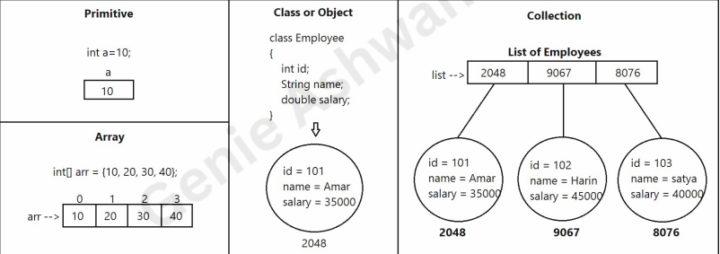
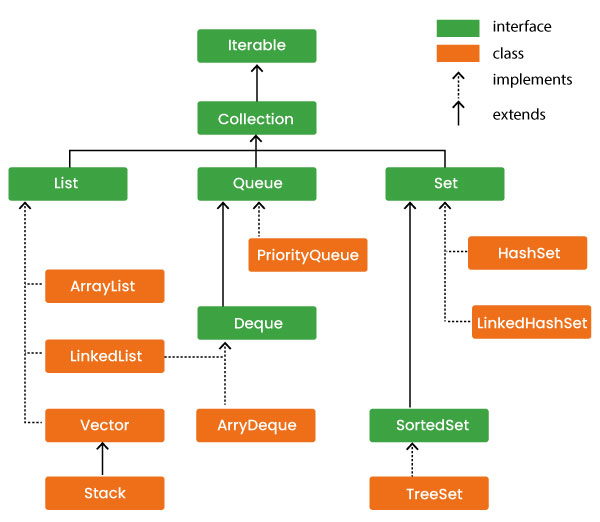

### How to store information in application?
* We use variables of different data	types to store	information.
  - Primitive type: Store only	one value at a time.
  - Array: Store more than one value but of same type
  - Object: Store more than one value of different types
  - Array of Objects : Store fixed number of objects(Not recommended)
  - Collection of Objects: Store objects dynamically(Not fixed size)



### What is Collection in Java
* Collection is a group of objects.
* Examples, List, Set, Queue, Map etc.

### Define Array and Collection:
* Array	is static	– fixed size
* Collection is dynamic – size grows and shrinks with insertions and deletions.

### What is the Java Collection Framework?
* Collection Framework is a collection of interfaces and implemented classes
* Java Collections can achieve all the operations that you perform on a data such as searching, sorting, insertion, manipulation, and deletion.

### What is the need of storing group of objects?
* To store the record type information which is fetching from Database.
* To	perform	Different	types	of	operations	on	group	of	objects	like	insertion,	Deletion,
Updating, searching, sorting etc...
* Can set multiple objects to method as a parameter.
* Method can	return multiple objects at	a time after processing
### Java Collection Framework Hierarchy
* hierarchy of Collection framework. The java.util package contains all the classes and interfaces for the Collection framework.



### Iterable Interface
* The Iterable interface is the root interface for all the collection classes. 
* The Collection interface extends the Iterable interface and therefore all the subclasses of Collection interface also implement the Iterable interface.
* It contains only one abstract method.
```
Iterator<T> iterator()  
```
* It returns the iterator over the elements of type T.
### what is collection interface?
* The Collection interface is the interface which is implemented by all the classes in the collection framework

### Methods of Collection interface

| Method        | Description  |
|---------------|-----------------|
| add()         | Add objects to collection.|
| addAll()      | It is used to insert the specified collection elements in the invoking collection.|
| isEmpty()     | Returns true if collection is empty |
| clear()       |Removes all elements from the collection |
| remove()      | Remove a selected object |
| removeAll()   | It is used to delete all the elements of the specified collection|
| size()        | Find the number of elements |
| stream()      |Return Sequential elements|
| toArray()     | Returns elements in array format |
| hashCode()    | Returns Hashcode of the elements |
| equals(obj X) | Compare an element with the collection |
| iterator()    | Return an iterator over collection |
| max()         | Return max value in the collection |
| contains()    | Returns true is a particular value is present|
| containsAll() | It is used to search the specified collection in the collection.|
| spliterator() | Creates splietarator over the elements in the collection|
| retainAll()   | Retains elements in the collection|

### Iterator interface
* Iterator interface provides the facility of iterating the elements in a forward direction only.
### Methods of Iterator interface
* There are only three methods in the Iterator interface. They are:

| Method        | Description                                                                   |
|---------------|-------------------------------------------------------------------------------|
| hasNext()         | It returns true if the iterator has more elements otherwise it returns false. |
| next()      | It returns the element and moves the cursor pointer to the next element.      |
| remove()     | It removes the last elements returned by the iterator. It is less used.                                          |

### what is List Interface?

* The List interface enables the user to maintain an ordered collection of elements 
with the help of indexing methods and can perform data manipulation operations 
such as insert, update, delete.
* List allow duplicate values
* List interface has some methods

Syntax:
```
List<Obj> list = new ArrayList<Obj> (); 

```
* Obj is the type of the object to be stored in List
```java
import java.util.ArrayList;
import java.util.List;

public class ListExample {
    public static void main(String args[]) {
        
        // Create a List of Strings
        List<String> list = new ArrayList<>();

        //here, write different operations in List
      
        // Displaying the List
        System.out.println("List : " + list); // List : []
    }
}
```
### Operations in a Java List Interface
1. Adding elements to List class using add() method
2. Updating elements in List class using set() method
3. Searching for elements using indexOf(), lastIndexOf methods
4. Removing elements using remove() method
5. Accessing Elements in List class using get() method
6. Checking if an element is present in the List class using contains() method
7. Iterating over List Interface in Java

### 1. Adding elements to List class using add() method
* it takes two parameters.
  - add(Object): This method is used to add an element at the end of the List.
  - add(int index, Object): This method is used to add an element at a specific index in the List
```java
import java.util.ArrayList;
import java.util.List;

public class List_Interface_And_methods_02 {
    public static void main(String[] args) {
        // Create a List of Integer
        List<Integer> list2 = new ArrayList<Integer>();
        list2.add(1);
        list2.add(2);
        list2.add(3);

        System.out.println(list2); // [1, 2, 3]

        List<Integer> list = new ArrayList<Integer>();
        list.add(0,1); // index 0 and element 1
        list.add(1,0); // index 1 and element 0
        // Displaying the List
        System.out.println("List elements: " + list); // List elements: [1, 0]

      // Will add list list2 from 1 index in list
        list.addAll(1,list2);
        System.out.println(list); // [1, 1, 2, 3, 0]
    }
}
```
### 2. Updating elements in List class using set() method
```java
import java.util.ArrayList;
import java.util.List;

public class List_Interface_And_methods_02 {
    public static void main(String[] args) {
        // Create a List of Integer
        List<Integer> list = new ArrayList<Integer>();
        list.add(0,1); // index 0 and element 1
        list.add(1,0); // index 1 and element 0
        // Displaying the List
        System.out.println("List elements: " + list); // List elements: [1, 0]
      
        // update 0th element with 5
        // in List 1
        list.set(0, 5);

        // Again printing the updated List 1
        System.out.println(list); // [5,0]


    }
}

```
### 3. Searching for elements using indexOf(), lastIndexOf methods
* indexOf(element)
  - Returns the index of the first occurrence of the specified element in the list, or -1 if the element is not found      
* lastIndexOf(element)
  - Returns the index of the last occurrence of the specified element in the list, or -1 if the element is not found
```java

import java.util.ArrayList;
import java.util.List;

public class List_Interface_And_methods_02 {
    public static void main(String[] args) {
        // Create a List of Integer
        List<Integer> numbers = new ArrayList<>();
  
        // add some integers to the list
        numbers.add(1);
        numbers.add(2);
        numbers.add(3);
        numbers.add(2);
        // Displaying the List
        System.out.println("List elements: " + numbers); // List elements: [1, 2, 3, 2]
      
        int index = numbers.indexOf(2);
        System.out.println("The first occurrence of 2 is at index :"+ index); // 1

        int lastIndex = numbers.lastIndexOf(2);
        System.out.println("The last occurrence of 2 is at index :"+ lastIndex); // 3

    }
}
```
### 4. Removing elements using remove() method
* remove(Object)
  - This method is used to simply remove an object from the List. 
  - If there are multiple such objects, then the first occurrence of the object is removed.
* remove(int index)
  - removes the element present at that specific index in the List.
```java

import java.util.ArrayList;
import java.util.List;

public class List_Interface_And_methods_02 {
    public static void main(String[] args) {
        // Create a List of Integer
        List<Integer> numbers = new ArrayList<>();
  
        // add some integers to the list
        numbers.add(1);
        numbers.add(2);
        numbers.add(3);
        numbers.add(2);
        // Displaying the List
        System.out.println("List elements: " + numbers); // List elements: [1, 2, 3, 2]

      // Now remove element from the above list
      // present at 1st index
        numbers.remove(1);
        
        numbers.remove(3); 
    }
}
```
### 5. Accessing Elements in List class using get() method
* get(int index): This method returns the element at the specified index in the list.
```java
// Importing all utility classes
import java.util.*;

// Main class
class GFG {
    // Main driver method
    public static void main(String args[])
    {
        // Creating an object of List interface,
        // implemented by ArrayList class
        List<String> al = new ArrayList<>();

        // Adding elements to object of List interface
        al.add("learn");
        al.add("java");
        al.add("daily");

        // Accessing elements using get() method
        String first = al.get(0);
        String second = al.get(1);
        String third = al.get(2);

        // Printing all the elements inside the
        // List interface object
        System.out.println(first); // learn
        System.out.println(second); // java
        System.out.println(third); // daily
        System.out.println(al); // [learn,java,daily]
    }
}
```
### 6. Checking if an element is present in the List
* contains(Object)
  - This method takes a single parameter, the object to be checked if it is present in the list.
```java
// Importing all utility classes
import java.util.*;

// Main class
class GFG {
    // Main driver method
    public static void main(String args[])
    {
        // Creating an object of List interface,
        // implemented by ArrayList class
        List<String> al = new ArrayList<>();

        // Adding elements to object of List interface
        al.add("learn");
        al.add("java");
        al.add("daily");
        
        // Checking if element is present using contains()
        // method
        boolean isPresent = al.contains("daily");

        System.out.println(isPresent); // true
    }
}
```
### 8.Iterating over List Interface in Java

* Iterating over list can be possible in two ways.
  - for loop 
  - for each loop
```java

import java.util.ArrayList;
import java.util.List;

public class List_Interface_And_methods_02 {
    public static void main(String[] args) {
        // Create a List of Integer
        List<Integer> list = new ArrayList<Integer>();
        list.add(0,1); // index 0 and element 1
        list.add(1,0); // index 1 and element 0
        list.add(1,2); // index 1 and element 0
        // Displaying the List
        System.out.println("List elements: " + list); // List elements: [1, 0,2]
      

        for (int i=0;i<list.size();i++){
            System.out.print(list.get(i)+",");
        }
        for (Integer integer : list) {
            System.out.print(integer + ",");
        }
    }
}

```
### Methods of List interface

| Method                     | Description                                                                                                                                                          |
|----------------------------|----------------------------------------------------------------------------------------------------------------------------------------------------------------------|
| add(int index, element)    | add element at particular index in the list, when single parameter is passed it will add end of the list                                                             |
| addAll(int index, element) | add all the elements in the given collection to the list. When a single parameter is passed, it adds all the elements of the given collection at the end of the list |
| isEmpty()                  | Returns true if collection is empty                                                                                                                                  |
| clear()                    | Removes all elements from the collection                                                                                                                             |
| remove(int index)          | removes an element from the specified index. It shifts subsequent elements(if any) to left and decreases their indexes by                                            |
| remove(element)            | This method is used with Java List Interface to remove the first occurrence of the given element in the list.                                                        |
| size()                     | This method is used with Java List Interface to return the size of the list.                                                                                         |
| get(int index)             | This method returns elements at the specified index.                                                                                                                 |
| set(int index, element)    | This method replaces elements at a given index with the new element.                                                                                                 |
| indexof(element)           | This method returns the first occurrence of the given element or -1                                                                                                  |
| lastIndexof(obj X)         | This method returns the last occurrence of the given element or -1                                                                                                   |
| iterator()                 | Return an iterator over collection                                                                                                                                   |
| equals(element)            | to compare the equality of the given element with the elements of the list.                                                                                                                                   |
| contains()                 | Returns true is a particular value is present                                                                                                                        |
| containsAll()              | It is used to search the specified collection in the collection.                                                                                                     |
| hashcode()                 | o return the hashcode value of the given list.                                                                                                             |
| sort(Comparator comp)()    | to sort the elements of the list on the basis of the given comparator.                                                                                                                                   |

* List are classified into 4 types
  - ArrayList
  - LinkedList
  - Vector
  - Stack
### 1. ArrayList
* ArrayList is an ordered collection and allow	duplicates.
* ArrayList is	index based.
* Processing elements much faster (index based)
* Insertions and Deletions are	slower (shifting of	elements takes time)
```java
import java.util.List;

public class ArrayList {
    public static void main(String[] args) {
        // Size of ArrayList
        int n = 5;
        // Declaring the List with initial size n
        List<Integer> arraylist = new java.util.ArrayList<Integer>(n);
        // Appending the new elements at the end of the list
        for (int i=1;i<=n;i++){
            arraylist.add(i);
        }
        // Printing elements
        System.out.println(arraylist);

        // Remove element at index 3
        arraylist.remove(3);

        // Displaying the list after deletion
        System.out.println(arraylist);

        // Printing elements one by one
        for (int i=0;i<arraylist.size();i++){
            System.out.println(arraylist.get(i)+" ");
        }
    }
}
```
### ListIterator:
* It is an	interface
  - listIterator() method returns ListIterator object.
  - Using ListIterator, we can iterate elements,
    - In Forward direction
    - In Backward direction
    - From specified index value
### Forward Direction
Iterator List in Forward Direction using hasNext() and next() methods:
```java
package Chapter_23_Collection_FrameWork.ListIterator;

import java.util.ArrayList;
import java.util.List;
import java.util.ListIterator;

public class ForwardDirection {
    //Iterator List in Forward Direction using hasNext() and next() methods:
    public static void main(String[] args) {
        List<Integer> list = new ArrayList<>();
        for (int i =1;i<=5;i++){
            list.add(i);
        }
        System.out.println(list);
        ListIterator<Integer> it = list.listIterator();
        while (it.hasNext()){
            System.out.println(it.next());
        }
    }
}
```
### Backward Direction
* Iterator List in Backward Direction using hasPrevious() and previous() methods:
```java
package Chapter_23_Collection_FrameWork.ListIterator;

import java.util.ArrayList;
import java.util.List;
import java.util.ListIterator;

public class BackwardDirection {
    public static void main(String[] args) {
        // Iterator List in Backward Direction using hasPrevious() and previous() methods.
        List<Integer> list = new ArrayList<>();
        for (int i =1;i<=5;i++){
            list.add(i);
        }
        System.out.println(list);
        ListIterator<Integer> it = list.listIterator(list.size());
        while (it.hasPrevious()){
            System.out.println(it.previous());
        }
    }
}
```
### 2. Vector:
   a. Accessing elements much faster.
   b. Insertions and Deletions are	slower	– shifting elements	takes time.
   c. Vector implements a dynamic array that means it can grow or shrink as required 
   d. Vector implements List.
   e. Vector allow	duplicates and follow	insertion order.
   f. Vector is synchronized by	default
```java

import java.util.List;

public class Vector {
    public static void main(String[] args) {
        // Size of ArrayList
        int n = 5;
        // Declaring the List with initial size n
        List<Integer> v = new java.util.Vector<Integer>(n);
        // Appending the new elements at the end of the list
        for (int i=1;i<=n;i++){
            v.add(i);
        }
        // Printing elements
        System.out.println(v);

        // Remove element at index 3
        v.remove(3);

        // Displaying the list after deletion
        System.out.println(v);

        // Printing elements one by one
        for (int i=0;i<v.size();i++){
            System.out.println(v.get(i)+" ");
        }
    }
}
```
### Enumeration:
• Vector is legacy(old) class since first version of JDK.
• Enumeration interface used to process vector element by element.
• elements()	method of Vector class returns Enumeration-interface.
### Methods of Enumeration:
1. hasMoreElements(): is used to check the element is present or not in Enumeration
2. nextElement(): returns the next element in the enumeration.

```java
import	java.util.*;
class Code {
    public static void main(String[] args)
    {
        Vector<Integer>	v	=	new	Vector<Integer>();
        for (int i=1	;	i<=5 ; i++){
            v.add(i*5);
        }
        System.out.println("Vector	:	");
        Enumeration<Integer>	en	=	v.elements();
        while(en.hasMoreElements())
        {
            Integer	x	=	en.nextElement();
            System.out.println(x);
        }
    }
}
```
### 3. Stack:
   a. Stack follows Last In First Out (LIFO) rule.
   b. Inserting and	removing elements from one end called TOP.

### Methods are:
1. boolean empty()	: Tests the stack is empty or not
2. Object peek():	returns the top element of	stack	but not remove
3. Object pop(): returns the top element of	stack	and removes
4. void push(Object e):	push element on	to the stack

```java
package Chapter_23_Collection_FrameWork;

import java.util.List;
import java.util.Stack;

public class stack {
    public static void main(String[] args) {
        // Size of the stack
        int n = 5;

        // Declaring the List
        List<Integer> s = new Stack<Integer>();

        // Appending the new elements
        // at the end of the list
        for (int i = 1; i <= n; i++)
            s.add(i);

        // Printing elements
        System.out.println(s);

        // Remove element at index 3
        s.remove(3);

        // Displaying the list after deletion
        System.out.println(s);

        // Printing elements one by one
        for (int i = 0; i < s.size(); i++)
            System.out.print(s.get(i) + " ");
    }

}

```
  
### 4. LinkedList:
LinkedList implements List
* LinkedList allow duplicates and ordered collection.
* Linked List store elements in the form of	nodes and connect with links.
* Accessing elements – slower in LinkedList
* Insertions and Deletions are faster	– no	shifting of elements.

```java
package Chapter_23_Collection_FrameWork;

import java.util.List;

public class LinkedList {
    public static void main(String[] args) {
        // Size of the LinkedList
        int n = 5;

        // Declaring the List with initial size n
        List<Integer> ll = new java.util.LinkedList<Integer>();

        // Appending the new elements
        // at the end of the list
        for (int i = 1; i <= n; i++)
            ll.add(i);

        // Printing elements
        System.out.println(ll);

        // Remove element at index 3
        ll.remove(3);

        // Displaying the list after deletion
        System.out.println(ll);

        // Printing elements one by one
        for (int i = 0; i < ll.size(); i++)
            System.out.print(ll.get(i) + " ");
    }
}
```
### what is set interface?
* set interface is unordered collection of elements.
* set interface will not allow duplicate elements
* set interface extends collection
* no extra methods for set interface

```
Set<data-type> s1 = new HashSet<data-type>();  
Set<data-type> s2 = new LinkedHashSet<data-type>();  
Set<data-type> s3 = new TreeSet<data-type>();  
```

### Operations on the Set Interface

set1 = [1, 3, 2, 4, 8, 9, 0]
set2 = [1, 3, 7, 5, 4, 0, 7, 5]
1. Intersection 
   - This operation returns all the common elements from the given two sets
   - Intersection = [0, 1, 3, 4]
2. Union
   - This operation adds all the elements in one set with the other
   - Union = [0, 1, 2, 3, 4, 5, 7, 8, 9] 
3. Difference
   - This operation removes all the values present in one set from the other set
   - Difference = [2, 8, 9]

* Set Classified into some types.
    - HashSet
    - LinkedHashSet
    - TreeSet

### HashSet
* does’t maintain insertion order.
* object are inserted based on hashcode

```java
package Chapter_23_Collection_FrameWork;
import java.util.Arrays;
import java.util.Set;
public class HashSet {
    public static void main(String[] args) {
        Set<String> hash_Set = new java.util.HashSet<String>();

        // Adding elements to the Set
        // using add() method
        hash_Set.add("learn");
        hash_Set.add("coding");
        hash_Set.add("daily");
        hash_Set.add("two");
        hash_Set.add("hours");

        System.out.println(hash_Set);

        // Creating an object of Set class
        // Declaring object of Integer type
        Set<Integer> a = new java.util.HashSet<Integer>();

        // Adding all elements to List
        a.addAll(Arrays.asList(new Integer[] { 1, 3, 2, 4, 8, 9, 0 }));

        // Again declaring object of Set class
        // with reference to HashSet
        Set<Integer> b = new java.util.HashSet<Integer>();

        b.addAll(Arrays.asList(new Integer[] { 1, 3, 7, 5, 4, 0, 7, 5 }));


        // To find union
        Set<Integer> union = new java.util.HashSet<Integer>(a);
        union.addAll(b);
        System.out.print("Union of the two Set");
        System.out.println(union);

        // To find intersection
        Set<Integer> intersection = new java.util.HashSet<Integer>(a);
        intersection.retainAll(b);
        System.out.print("Intersection of the two Set");
        System.out.println(intersection);

        // To find the symmetric difference
        Set<Integer> difference = new java.util.HashSet<Integer>(a);
        difference.removeAll(b);
        System.out.print("Difference of the two Set");
        System.out.println(difference);

    }
}
```

### LinkedHashSet
* maintains insertion order.
* When the iteration order is needed to be maintained this class is used
* When iterating through a HashSet the order is unpredictable,
```java
package Chapter_23_Collection_FrameWork;
import java.util.Iterator;
import java.util.Set;
public class LinkedHashSet {
    public static void main(String[] args)
    {
        Set<String> lh = new java.util.LinkedHashSet<String>();

        // Adding elements into the LinkedHashSet
        // using add()
        lh.add("India");
        lh.add("Australia");
        lh.add("South Africa");

        // Adding the duplicate
        // element
        lh.add("India");

        // Displaying the LinkedHashSet
        System.out.println(lh);

        // Removing items from LinkedHashSet
        // using remove()
        lh.remove("Australia");
        System.out.println("Set after removing "
                + "Australia:" + lh);

        // Iterating over linked hash set items
        System.out.println("Iterating over set:");
        Iterator<String> i = lh.iterator();
        while (i.hasNext())
            System.out.println(i.next());
    }
}
```
### TreeSet
* maintains sorted order.

```
Set<String> ts = new TreeSet<String>();
```
```java
import	java.util.*;
class Code {
public static void main(String[] args) {
Set<Integer>	set	=	new	TreeSet<Integer>();
set.add(50);
set.add(40);
set.add(30);
set.add(20);
set.add(10);
System.out.println("Set :" + set);
}
}
// Output: 10, 20, 30, 40, 50
```
### Map Interface

* Store values using keys
  - Map = {key=value, key=value, key=value ….}
* Keys	must be	unique in Map
* Values can be duplicated.
  - For example, book names(unique) with prices(duplicates)
    - Books = {C=300.0 , C++=300.0, Java=350.0, Python=330.0};

### Set<K> keySet():
• We cannot iterate the map object either by	using Iterator or using for-each loop.
• First we need to collect all keys	of map using keySet() method.
• We iterate keys set and get values by specifying each key

### Iterate Map through Iterator:
• Collect the keys using keySet() method.
• Create Iterator from the keys Set.
• Iterate the object and get Values by specifying keys.

```java
import	java.util.*;
class Code
{
public static void main(String[] args) throws Exception
{
String[]	books	=	{"C",	"C++",	"Java",	"Python",	"Android"};
double[] prices = {200.0, 300.0, 250.0,	200.0, 250.0};
Map<String,	Double>	map	=	new	HashMap<String,	Double>();
for(int i=0 ; i<=books.length-1	; i++)
{
map.put(books[i], prices[i]);
}
System.out.println("Map	is	:	");
Set<String>	keys	=	map.keySet();
Iterator<String>	itr	=	keys.iterator();
while(itr.hasNext())
{
String key	= itr.next();
Double	value	=	map.get(key);
System.out.println(key	+ "	= "	+ value);
}
}
}
```
