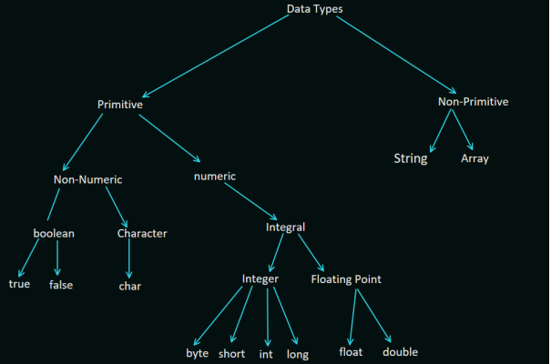
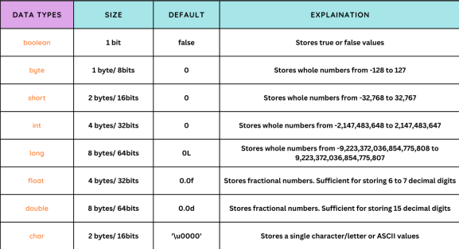

### What is Variable?

* Variables are used to store the data during the program execution.
* We need to specify the type of the variable to store the data
* To Specify the type of data we use **DataTypes**
* You can change the value of variable.
* Variable take the memory space(when runtime) depending on the data or size of data is stored inside the variable.

Example

```aidl
int a = 10;
byte b = 10;
float f = 10.2f;
char c = "hello"
```
### Variable Naming Rules

* Case Sensitive
  - Both are variable are different in java.
  - both variable cannot be same

```aidl
int age;
int Age;
// both variable cannot be same 
int x;
float x;
// this is allowed
int x;
float X; 
```

* Contains Aplhabets, Numbers _ or $
```aidl
int room1;
int cabnet151;
int room_number;
int room$number
```
* Start with Aplhabets, _ or &
```aidl
byte x1;
byte 1x; // not allowed
byte _x;
byte $x;
```
* Variable name Should not be a keyword
* Should not be a class name, if class is also in use
* No limit on length of name
* Follow Camel Cases

### Java Variables Types

* Local variables
* Instance variables
* Static variables

### Local Variable

* A Variable declared inside the body method or method parameter is called local variable
* Access modifiers cannot be used for local variables.
* Local variables are visible only within the declared method, constructor, or block.
* Local variables are implemented at stack level internally.
* There is no default value for local variables, so local variables should be declared and an initial value should be assigned before the first use.

```java
package Chapter_03_DataTypes_Variables;

import Chapter_03_DataTypes_Variables.TypeOfVariables.Local_Variables_01;

public class Variables_02 {

    // creating method
    public void fun() {
        int a = 10; // local variable inside the fun() method, its scope is limited to only this method
        System.out.println(a);
    }

    public void Age() {
        int age; // this is also local variable but value is not initializing, so it would give an error at the time of compilation
        // value = age + 10;
        // System.out.println(value);
    }

    public static void main(String[] args) {
        // to access the method we need to create a object
        Local_Variables_01 variables_02 = new Local_Variables_01();
        // calling the method using object
        variables_02.fun();
        variables_02.Age();
    }
}
```
### Instance Variable

* A Variable which is declared inside the class but outside all the methods called instacne variable.
* Instance variables are declared in a class, but outside a method, constructor or any block.
* Instance variables are created when an object is created with the use of the keyword 'new' and destroyed when the object is destroyed.
* Instance variables can be declared in class level before or after use.
* Access modifiers can be given for instance variables.If we do not specify any access specifier, then the default access specifier will be used.
* The instance variables are visible for all methods, constructors and block in the class. Normally, it is recommended to make these variables private (access level). However, visibility for subclasses can be given for these variables with the use of access modifiers.

```java
package Chapter_03_DataTypes_Variables;

import Chapter_03_DataTypes_Variables.TypeOfVariables.Instance_Variable_02;

public class Instance_Variable_03 {

    // This is instance variable and visible for any child class
    public String LastName;

    // This is instance variable and visible in lastName class only.
    private String FirstName;

    // The LastName Variable assign in the Constructor
    public void LastName(String lastName) {
        LastName = lastName;
    }

    // The FirstName variable is assigned a value.
    public void FirstName(String firstName) {
        FirstName = firstName;
    }

    public void printFullName() {
        System.out.println("FirstName " + FirstName);
        System.out.println("LastName " + LastName);
    }

    public static void main(String[] args) {
        Instance_Variable_02 instance_variable_03 = new Instance_Variable_02();
        instance_variable_03.LastName("Naveen");
        instance_variable_03.FirstName("Rapelly");
        instance_variable_03.printFullName();
    }
}
```
### Static Variable
* Static variables are also known as class variables.
* A Variable which is declared with the help of static keyword then it is called static variable.
* Static variables are stored in the static memory. It is rare to use static variables other than declared final and used as either public or private constants.
* Static variables are created when the program starts and destroyed when the program stop.
* Visibility is similar to instance variables. However, most static variables are declared public since they must be available for users of the class.

### Differences Between the Instance Variables and the Static Variables?
* Each object will have its own copy of an instance variable, whereas we can only have one copy of a static variable per class, irrespective of how many objects we create. Thus, static variables are good for memory management.
* Changes made in an instance variable using one object will not be reflected in other objects as each object has its own copy of the instance variable. In the case of a static variable, changes will be reflected in other objects as static variables are common to all objects of a class.
* We can access instance variables through object references, and static variables can be accessed directly using the class name.
* Instance variables are created when an object is created with the use of the keyword ‘new’ and destroyed when the object is destroyed. Static variables are created when the program starts and destroyed when the program stops.

### What is DataTypes?

* Data Type Specify the different size & value that can be stored in the variables.

### Different types of datatype



* Range of data types

