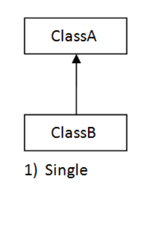
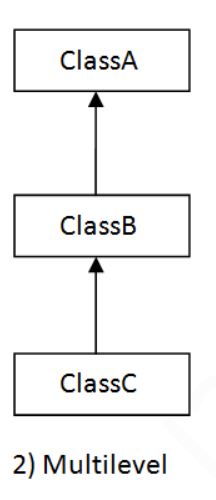

### what is Inheritance?
* Inheritance in Java is a mechanism in which one object acquires all the properties and behaviors of a parent object.
* Inheritance	is	same	as	specialization

* For	Example
    - A	old	style	television	(idiot	box)	is	transformed	with	extra	features	into	slim	and
      smart	television	where	it	re-used	the	properties	of	old	television.

Before learning inheritance Lets learn about Generalization VS specialization

### Generalization VS specialization
* Common	thing	in	Generalisation	and	Specialisation	is	they	are	in	the
  form	of	Hierarchy
* It	is	Like	a	Parent	Class	and	Child	Class(or)Base	Class													and
  Derived	Class(or)	Super	Class	and	Sub	Class.

* Generalization
    - In	Generalisation	group	of	classes	are	referred	with	Super	class	with
      single	name.
    - Generalisation	means	Bottom	Up.
    - In	Generalisation	A	Super	Class	Is	made	by	Grouping	Multiple	Sub
      Classes.
    - Generalisation	is	achieved	using	Interfaces

Example

* Generalization
    - 1.Smart Phone
        - I phone
        - Samsung
        - Vivo
    - 2.Vehicle -Car
        -  Bike
        - Ship
- For	achieving	Generalisation	Abstract	Classes	are	Used
* Specialization
    - In	Specialisation	a	new	Sub	Class	is	Generated	by	borrowing	the
      features	of	existing	concrete	class	and	adding	new	features	to	it.
    - Specialisation	means	Top	Down.
    - In	specialisation	a	new	Class	is	derived	from	an	existing	Super	Class.
      Specialisation	is	achieved	using	Inheritance.
      Example:
- Specialization
    - I Phone X -> I Phone XS
    - Innova -> Fortuner
    - Circle -> Cylinder
    - Guitar -> Electric Guitar
#### How to achieve above topics
Specialization --> this can be used in inheritance
Generalization --> this can be achieved in interface

In between this we have called abstract class

### What Is Inheritance?
* Inheritance	is	the	process	of	acquiring	features	of	an	existing	Class into	a	New	Class.
* The idea behind inheritance in Java is that you can create new classes that are built upon existing classes. When you inherit from an existing class, you can reuse methods and fields of the parent class. Moreover, you can add new methods and fields in your current class also.
* Inheritance represents the IS-A relationship which is also known as a parent-child relationship.
###  Why use inheritance in java
* For Method Overriding (so runtime polymorphism can be achieved).
* For Code Reliability.
* Rules to follow:
  - In java, we used extend keyword to perform inheritance.
  - It provide code re-usability
  - we can't access private members of class through inheritance
  - A subclass contain all the feature of super class, so we should create the object of subclass.
  - method overriding only possible through inheritance
Synatx:
```
class Subclass-name extends Superclass-name  
{  
   //methods and fields  
}  
```
* The extends keyword indicates that you are making a new class that derives from an existing class. The meaning of "extends" is to increase the functionality.

* Types of inheritance
    - Single Level inheritance
    - multi level inheritance
    - Hierarchical inheritance
    - Multiple
    - Hybrid

### Single Level Inheritance:

* When a class inherits another class, it is known as a single inheritance


Example:

```java
class circle2{
    public double radius;
    public double area(){
        return  Math.PI*radius*radius;
    }
    public double perimeter(){
        return 2*Math.PI*radius;
    }
    public double circumference(){
        return perimeter();
    }
}
class Cylinder extends circle2{
    public double height;
    public double volume(){
        return area()*height;
    }
}
public class Inheritance_01 {
    public static void main(String[] args) {
        Cylinder cy = new Cylinder();
        // assigning the values to properties in the class
        cy.radius = 7;
        cy.height = 10;
        System.out.println("Volume "+ cy.volume());
        System.out.println("Area "+ cy.area());
    }
}
```
### Multi Level Inheritance

* When there is a chain of inheritance, it is known as multilevel inheritance.




```java

class Animal{
    void eat()
    {
        System.out.println("eating...");
    }
}
class Dog extends Animal{
    void bark(){
        System.out.println("barking...");
    }
}
class BabyDog extends Dog{
    void weep(){
        System.out.println("weeping...");
    }
}
public class Multi_Level_Inheritance {
    public static void main(String[] args) {
        BabyDog d=new BabyDog();
        d.weep();
        d.bark();
        d.eat();
    }
}
```
### Hierarchical inheritance

* When two or more classes inherits a single class, it is known as hierarchical inheritance

```java
class Animals{
    void eat(){System.out.println("eating...");}
}
class Dogs extends Animals{
    void bark(){System.out.println("barking...");}
}
class Cat extends Animals{
    void meow(){System.out.println("meowing...");}
}
public class Multiple_Inheritance {
    public static void main(String[] args) {
        Cat c=new Cat();
        c.meow();
        c.eat();
//c.bark();//C.T.Error  
    }
}

```

#### Why multiple inheritance is not supported in java

* To reduce the complexity and simplify the language, multiple inheritance is not supported in java.
* Consider a scenario where A, B, and C are three classes. The C class inherits A and B classes. If A and B classes have the same method and you call it from child class object, there will be ambiguity to call the method of A or B class
* Since compile-time errors are better than runtime errors, Java renders compile-time error if you inherit 2 classes. So whether you have same method or different, there will be compile time error.
```java
class A{  
void msg(){System.out.println("Hello");}  
}  
class B{  
void msg(){System.out.println("Welcome");}  
}  
class C extends A,B{//suppose if it were  
   
 public static void main(String args[]){  
   C obj=new C();  
   obj.msg();//Now which msg() method would be invoked?  
}  
}  
```
```
 Compile Time Error
```

#### How Constructor work in inheritance?

* Constructors	are	the	methods	of	class	which	are	automatically	called when	an	object	is	created.
* Constructors	are	executed	from	Top	to	Bottom	Class.
* To	make	the	child	class	object	print firstly	the	parent	class	constructor	must	be
  created

```java
class Parent
{
    public Parent()
    {
        System.out.println("Parent Constructor");
    }
}
class Child extends Parent
{
    public Child()
    {
        System.out.println("Child Constructor");
    }
}
class Grandchild extends Child
{
    public Grandchild()
    {
        System.out.println("Grand Child Constructor");
    }
}
public class Constructor_In_Inheritance {
    public static void main(String[] args) {
        Grandchild gc = new Grandchild();
    }
}
```
* In	the	given	example	Parent	Class	have	its	constructor	where	“parent
  constructor”	is	executed,	and	Child	Class	have	its	constructor	where	“Child
  Constructor”,	is	executed	and	Grandchild	Class	have	its	constructor	where
  “Grandchild	Constructor”	is	executed.

### How Parameterized Constructor works in inheritance?

```java
class Parent1
{
    public Parent1()
    {
        System.out.println("Parent Constructor");
    }
    public Parent1(int x){
        System.out.println("Parameter in constructor"+x);
    }
}
class Child1 extends Parent
{
    public Child1()
    {
        System.out.println("Child Constructor");
    }
    public Child1(int y)
    {
        System.out.println("parameter in Child Constructor"+y);
    }
    public Child1(int x, int y)
    {
        super();
        System.out.println("parameter in Child Constructor x = "+x + "y = "+y);
    }
}
public class Parameterized_Constructor_In_Inheritance {
    public static void main(String[] args) {
        Child1 ch = new Child1(10);
        Child1 ch1 = new Child1(10,12);
    }
}
```
