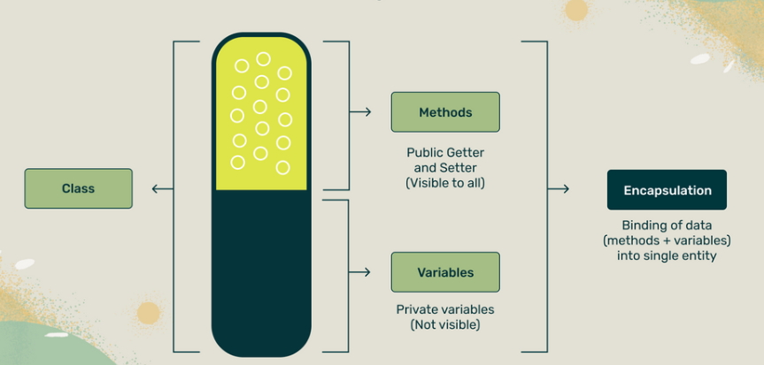

To understand Encapsulation  in-depth, one must be aware about access modifiers in Java.
### Access Modifier
* Classes, attributes, methods, and objects are mainly used to write programs in Java. Usually, a class is defined within a package (which is a collection of closely related classes).
* Java provides mainly four levels of visibility which can be applied to classes and all other members of a class (such as attributes, methods, etc.). These are called access modifiers.

* Public:
  -  If you declare something as public, it can be accessed from any other class in the application, irrespective of the package in which it is defined.
* Private:
  -  If you declare something as private it can be accessed only inside the class that defines it. Other classes in the same package and classes that inherit the class it is defined in also cannot access it. This makes private the most restrictive access modifier.
* Protected:
  -  If you declare something as protected, it can be only accessed by the class that defines it, its subclasses, and classes of the same package. Even if the subclass is there in another package, it is still accessible. This makes protected access less restrictive than private.
* Package:
  -  If you don’t specify a modifier, you give  access to the entity. It is also known as package access because it can only be accessed by classes within the same package. If you have a subclass defined in another package, it cannot see the default access attribute or method.

Let's understand this better with an example

### What is Encapsulation?
* Encapsulation	is	the	process	of	grouping data or binding data and method in	a single unit or section.
* The Main Advantage of encapsulation is that data is hidden and protected from randomly access by outside non-members methods of a class
* In Encapsulation, Data(Variable) are declared as private and methods are declared as public.
* For	Example
    - Complete	television	is	single	box	where all the mechanism	are	hidden inside the box all are capsuled.
* Encapsulation is achieved by declaring the variables as private and providing public setter and getter methods to modify and view the variable values.
* In encapsulation, the fields of a class are made read-only or write-only.



#### Without Encapsulation here’s what can happen

* Another programmer can change the value.

#### With Encapsulation however
* you can restrict access to the variable.
* your internal logic will be hidden from the user

#### Key ideas of Encapsulation
* Wrapping attributes and methods that manipulate those attributes, in a class.
* Restricting access to certain data and methods to only within a particular class.

* There are generally three things that can be done to implement Encapsulation in Java.
  - Make the instance variables private.
  - Use getter methods - these are methods that retrieve data
  - public returnType getPropertyName()
  - Use setter methods - these are methods that change data
  - public void setPropertyName()
- Let’s write a simple program to implement Encapsulation for the smartphone class.
```java
package Chapter_11_OOPS.Chapter_04_Encapsulation;
class SmartPhone{
    // Make Instance variable Private
    private int storage;
    private String model;
    // Write public setter method with validation checks if necessary

    public void setStorage(int phoneStorage){
        if (phoneStorage<100 || phoneStorage>256){
            storage = 100;
        }else {
            storage = phoneStorage;
        }
    }
    public void setModel(String phoneModel){
        model = phoneModel;
    }
    // Getter method
    public int getStorage(){
        return storage;
    }
    public String getModel(){
        return model;
    }
}
public class Encapsulation_02 {
    // main method
    public static void main(String[] args) {
        // creating an object for smartPhone
        SmartPhone sp = new SmartPhone();
        // calling method setStorage
        sp.setStorage(150);
        // calling method setModel
        sp.setModel("iphone");
        System.out.println(sp.getStorage());
        System.out.println(sp.getModel());

    }
}
```
#### Why use encapsulation in java?
* encapsulation is needed for several reason.
  - it implements data hiding and protect data from unwanted manipulations.
  - The functionality of the application is defined in one place that is one single class
  - public access to this functionality is safely provided
  - it helps mitigate the impact of changes
  - Application are not developed by a single person, Often you work in a team.
  Encapsulation make sure code is correctly it help makes changes to it without breaking everyone's code.
  - setter and getter helps revise code safely
### Note
* Setter methods cannot be overridden. This is because they act on private variables. So if a subclass tries to override a setter method, using the private variable within the method, the compiler will throw an error. Therefore, the key to Encapsulation is the private keyword.
* A real-world example of a class that requires a private final keyword.