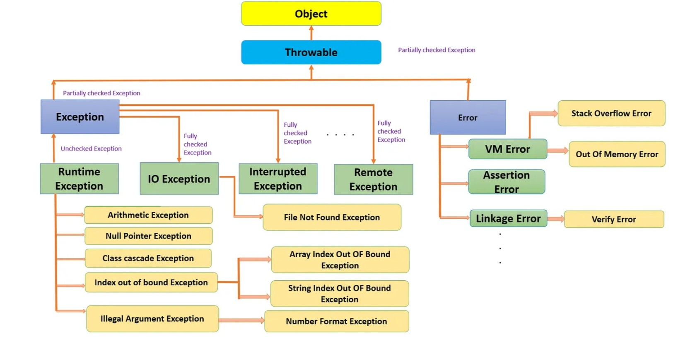
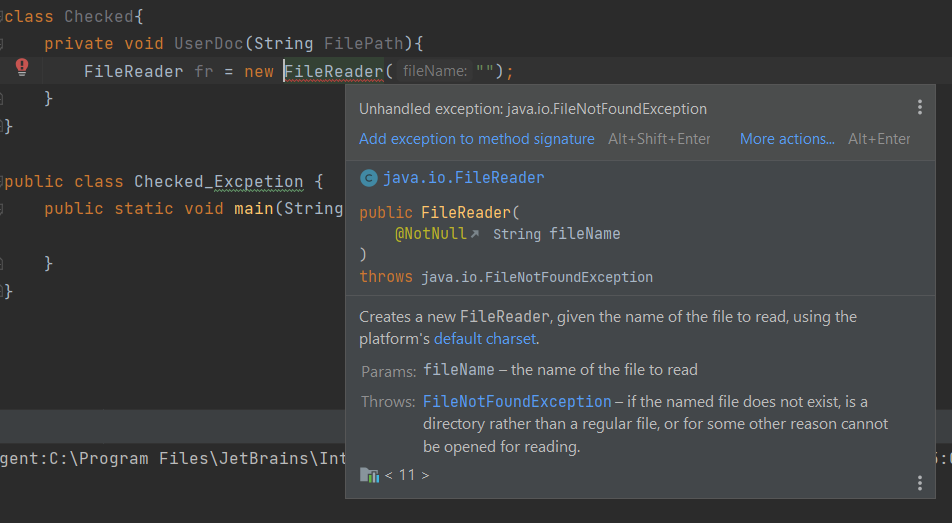
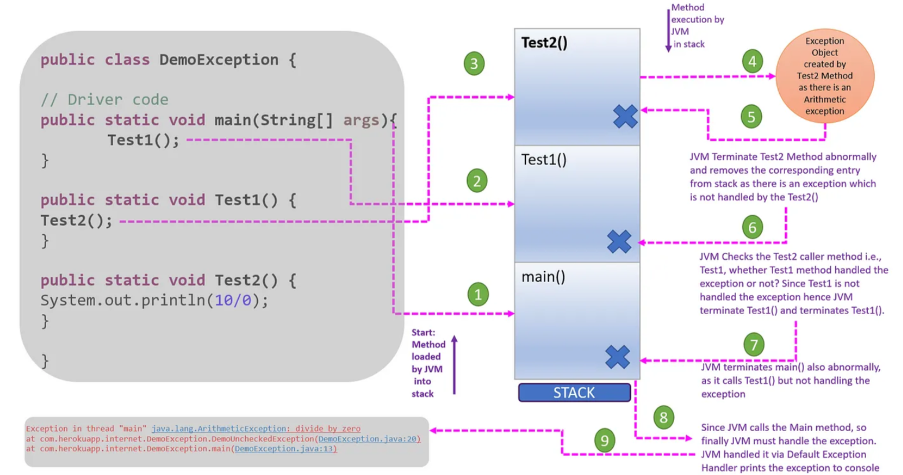
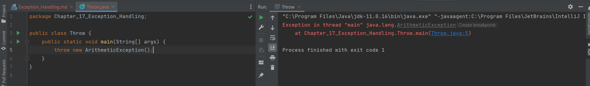
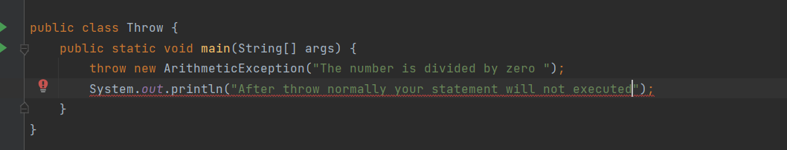
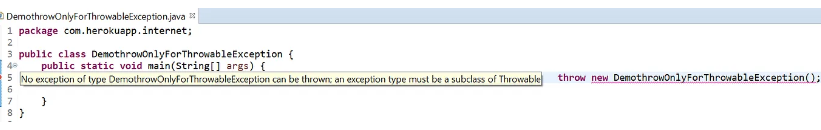
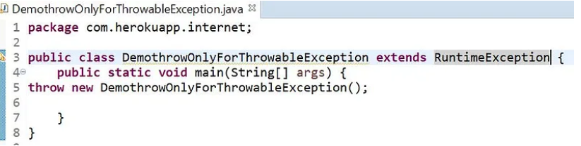
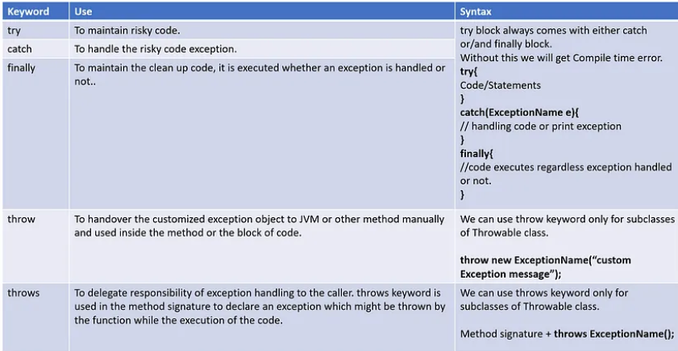

### What is Exception Handling in Java?
* Exception Handling is a mechanism to handle runtime errors such as ClassNotFoundException, IOException, SQLException, RemoteException, etc.

#### Exception Hierarchy in Java:
* In the java exception class hierarchy, the class at the top is the Throwable class, which is a direct subclass of the Object class. Throwable has two direct subclasses Exception and Error, which has again respective sub-classes The diagram below shows the standard exception and error classes defined in Java, organized in the Java exceptions hierarchy:


* Error: Error caused by the lack of system resources such as heap memory is not available etc. Errors are non-recoverable. During the runtime of a program if any error occurs we will not be able to handle it.

### Types of Exception in Java:
There are two types of exceptions available in java.
1. Checked Exception:
2. Unchecked Exception:

#### 1. Checked Exception

* For the smooth execution of the program, the compiler checks whether the programmer handled a particular exception or not which might occur during the runtime of the program. This type of exception is called a Checked exception.
* All the exception except Runtime Exception and its child classes and Error and its child classes and its child classes from the above hierarchy is comes under the checked exception.

Example:



#### 2. Unchecked Exception:
* The exception which is not checked by the compiler is called Unchecked exception.
* This exception occurs during the run time of the program execution. All Runtime exception and its child classes, Error and its child classes fall under Unchecked exceptions.


#### Why do we need exception handling?
* To define some alternative way to continue the rest of the program normally i.e for a graceful termination of the program exception handling plays an important role. Exceptions are caused by the programmer’s programming code and can be handled by implementing certain code.

#### How to handle exceptions in Java?
There is two-way in java for exception handling.

#### 1. Default Exception Handling in Java by JVM:



1. For every thread, JVM will create one separate stack during runtime.

2. For every method call performed by this thread, one entry will be stored in the corresponding stack. Each entry is called an activation record of the stack frame.

3.  JVM will start executing from the top of the stack. If the method has exception JVM checks if that exception is being handled by the method or not, if not JVM terminates that method abnormally and removes(stack pop operation) the activation record from the stack frame.

4.  Now JVM checks the caller method if that has handled the exception or not. If not then it again terminates the caller method as well. This process continues, and if main() also not handled the exception then JVM terminates and removes the main() entry from the stack.

5. The responsibility of exception handling is now go to JVM, where JVM handle it via default exception handler which prints the exception message to the console in the format ExcepionInThreadMain.Name of the exception.atlineNumberMethodName() and terminates the program.

#### 2. Exception handling by Programmer using code:

* In Java, a programmer can handle exceptions via five keywords: try, catch, finally, throw and throws. Let’s discuss briefly each one.

#### 1. try-catch block:

* try-catch block in java can be used for handling the risky code and can be used for both checked and unchecked exceptions. Let’s have a look at it:

```java
package Chapter_17_Exception_Handling;
public class Try_Catch {
    public static void main(String[] args) {
        int a =10;
        int b = 0;
        try {
            int result = a/b;
            System.out.println(result);
        }
        catch(ArithmeticException e){
            System.out.println("Denominator should not be 0, try again");
        }
        System.out.println("Bye");
    }
}
```
```
try
{
statement 1;
statement 2;
statement 3;
}
catch (xxxx e){
statement 4;
}
statement 5;
Case 1: If There is No Exception: Statement 1, 2, 3, 5, no abnormal termination.
Case 2: If an exception occurs at statement 2 and corresponding catch block matched: Executes statement 1, 4, 5, no abnormal termination.
Case 3: If an exception occurs at statement 2 and corresponding catch block Not matched: Executes statement 1, Abnormal Termination.
Case 4: If an exception occurs at Statement 2 and Statement 4: Executes Statement 1, then abnormal termination
Case 5: If an exception occurs at Statement 5: Executes Statement 1,2,3 then abnormal termination because cache doesn’t handle code outside try block.
```
### Methods To Print Exception to console:

* Throwable class contain the following 3 methods to print exception.

1. e.printStackTrace
2. e.toString: System.out.println( e.toString()); same as System.out.println(e);
3. System.out.println(e.getMessage(););

#### 2. try with multiple catch blocks:

* In case of try with multiple catch blocks, it is compulsory we should take the child class exception to parent exception as shown below in Example 2, else we will get a compile-time error as shown in Example 1.
```
public class Try_Multiple_Catch {
    public static void main(String[] args) {
        int i,j=0;
        try{
            i = 90/j;
        }catch (Exception e){
            System.out.println(e);
        }catch (ArithmeticException e){ //Compiletime Error: Unreachable catch block for ArithmeticException. 
            // It is already handled by the catch block for Exception
            System.out.println(e);
        }
    }
}
```
* The correct way of handling try with multiple catch blocks:
```
public class Try_Multiple_Catch {
    public static void main(String[] args) {
        int i,j=0;
        try{
            i = 90/j;
        }catch (ArithmeticException e){
            System.out.println(e);
        }catch (Exception e){ //Compiletime Error: Unreachable catch block for ArithmeticException.
            // It is already handled by the catch block for Exception
            System.out.println(e.getMessage());
        }
    }
}


```
#### 3. Finally block:
* The finally block code is always executed regardless exception is occurred or not, exception handled or not. This block especially can be used to maintain all cleanup code, such as close DB connection etc.
```java
public class Try_Catch_Finally {
    public static void main(String[] args) {
        int i,j=0;
        try{
            i = 90/j;
        }catch (ArithmeticException e){
            System.out.println(e);
        }catch (Exception e){ //Compiletime Error: Unreachable catch block for ArithmeticException.
            // It is already handled by the catch block for Exception
            System.out.println(e.getMessage());
        }finally {
            System.out.println("The finally block code is always executed regardless exception is occurred or not, exception handled or not");
        }
    }
}

```
#### Finally vs Return
* Post try block execution, finally block gets executed even though return statement is available inside try block. finally-block gets more priority than the return statement. In case all try block, cache block, finally block return some value, then finally block return takes priority.
```
/**
* Demo: return statement in all try, cache, finally block.
* Finally block return statement takes priority.
  */
  @SuppressWarnings(“finally” )
  public int DemoReturn() {
  try {
  int i = 90 / 9;
  return i ;
  } catch (NullPointerException e ) {
  return 92;
  } finally {
  return 99; // o/p: 99
  }
  }
```
#### Finally Vs System.exit(0)
* JVM gets exit when System.exit(0); code executes. If in try block System.exit(0); is used then finally block will not get executed.
```
/**
 * Finally vs System.exit(0); JVM gets normally terminated when System.exit(0);
 * executes. Hence, finally block doesn’t gets executed. Note: System.exit(0);
 * // if we use 0 : Normal termination, For non-zero: abnormal termination o/p:5 
 *Finally block doesn’t gets executed.
 */

public class Try_Multiple_Catch {
    public static void main(String[] args) {
        int i,j=0;
        try{
            i = 90/j;
            System.out.println(i);
            System.exit(0);
        }catch (ArithmeticException e){
            System.out.println(e);
        }catch (Exception e){ //Compiletime Error: Unreachable catch block for ArithmeticException.
            // It is already handled by the catch block for Exception
            System.out.println(e.getMessage());
        }
    }
}

```
#### Control flow in try-catch-finally block:
```

try
{
statement 1;
statement 2;
statement 3;
}
catch (xxxx e){
statement 4;
}
finally{
statement 5;
}
statement 6;
Case 1: If There is No Exception: Statement 1, 2, 3, 5, 6 no abnormal termination.
Case 2: If an exception occurs at statement 2 and corresponding catch block matched: Executes statement 1, 4, 5, 6 no abnormal termination.
Case 3: If an exception occurs at statement 2 and corresponding catch block Not matched: Executes statement 1, 5, Abnormal Termination.
Case 4: If an exception occurs at Statement 2 and Statement 4: Executes Statement 1,5 then abnormal termination.
Case 5: If an exception occurs at Statement 5, or statement 6: Abnormal termination because cache doesn’t handle code outside try block.

```
#### Control flow in nested try-catch-finally block:
```
/**
* Nested Try catch finally Block:
*
*/
public void DemoNestedTryCatchFinallyBlock() {
try {
System. out.println(“Statement 1” );
System. out.println(“Statement 2” );
System. out.println(“Statement 3” );
try {
System. out.println(“Statement 4” );
System. out.println(“Statement 5” );
System. out.println(“Statement 6” );
} catch(Exception e ) {
System. out.println(“Statement 7” );
}
finally {
System. out.println(“Statement 8” );
}
System. out.println(“Statement 9” );
} catch (Exception e ) {
System. out.println(“Statement 10” );
} finally {
System. out.println(“Statement 11” );
}
System. out.println(“Statement 12” );
}
Case 1: If There is No Exception: Statement 1, 2, 3,4 5, 6,8,9,11,12 no abnormal termination.
Case 2: If an exception occurs at statement 2 and corresponding catch block matched: Executes statement 1, 10,11,12, no abnormal termination.
Case 3: If an exception occurs at statement 2 and corresponding catch block Not matched: Executes statement 1, 11, Abnormal Termination.
Case 4: If an exception occurs at Statement 5 and corresponding inner catch block matched: Executes statement 1,2,3,4,7,8,9,11,12, no abnormal termination.
Case 5: If an exception occurs at Statement 5 and corresponding inner catch block Not matched but outer catch block matched: Executes statement 1,2,3,4,8,10,11,12, no abnormal termination.
Case 6: If an exception occurs at Statement 5 and both inner catch block and outer catch block Not matched: Executes Statement 1,2,3,4,8,11 then abnormal termination.
Case 7: If an exception occurs at Statement 5 and 7 and corresponding catch block matched: Executes Statement 1,2,3,4,8,10,11,12, no abnormal termination.
Case 8: If an exception occurs at Statement 5 and 7 and corresponding catch block not matched: Executes Statement 1,2,3,4,8,11 and then abnormal termination.
Case 9: If an exception occurs at Statement 8 and corresponding catch block matched: Executes Statement 1,2,3,4,5,6,10,11,12 and then no abnormal termination.
Case 10: If an exception occurs at Statement 8 and corresponding catch block not matched: Executes Statement 1,2,3,4,5,6,11 and then abnormal termination.
Case 11: If an exception occurs at Statement 9 and corresponding catch block matched: Executes Statement 1,2,3,4,5,6,8,10, 11,12 and then no abnormal termination.
Case 12: If an exception occurs at Statement 9 and corresponding catch block not matched: Executes Statement 1,2,3,4,5,6,8, 11 and then abnormal termination.
Case 13: If an exception occurs at Statement 9 and corresponding catch block not matched: Executes Statement 1,2,3,4,5,6,8, 11 and then abnormal termination.
Case 14: If an exception occurs at Statement 2 and 10: Executes Statement 1,11 and then abnormal termination.
Case 15: If an exception occurs at Statement 11: Executes Statement 1,2,3,4,5,6,8,9 and then abnormal termination because cache doesn’t handle code outside try block.
Case 15: If an exception occurs at Statement 12: Executes Statement 1,2,3,4,5,6,8,9,11 and then abnormal termination because cache doesn’t handle code outside try block.
```
#### 4 throw keyword:
* To create a customized exception and handover it to the JVM, we use the throw keyword. The throw keyword is highly recommended for the unchecked exceptions.

Syntax: throw new ExceptionName (“Message”);

Example: throw new ArithmeticException(“You are dividing a number with zero”);



* After the throw statement, we cannot take any other statement directly.

* Apart from all inbuilt exception classes if a programme uses the throw keyword for any user-defined exceptions as shown below faces compile-time error as shown below.

* Programmer can resolve the above by extending any subclass of Throwable class(inheritance concept) as shown below:


### throws keyword:
* We can use throws keyword to delegate the responsibility of exception handling to JVM or any other method.
* It is required for only to continue the compiler and its usage doesn’t prevent abnormal termination of the program, hence this can be used only incase of checked exception.
throws keyword always we write with method signature.
* Like throw keyword, we can use throws keyword only for subclasses of Throwable class.

```java
package Chapter_17_Exception_Handling;
// custom exception
class Negative extends Exception{
    public String toString(){
        return "Dimension of Rectangle ";
    }
}

public class Throw {
    static int area(int l, int b) throws Negative {
        if(l<0 || b<0){
            throw new Negative();
        }
        return l*b;
    }
    static void meth1() throws Negative {
        System.out.println("Area "+ area(10,20));
    }
    public static void main(String[] args){
        try{
            meth1();
        }catch (Exception e)
        {
            System.out.println(e);
        }
//        throw new ArithmeticException("The number is divided by zero ");
//        System.out.println("After throw normally your statement will not executed");
    }
}
```

* Summary 



